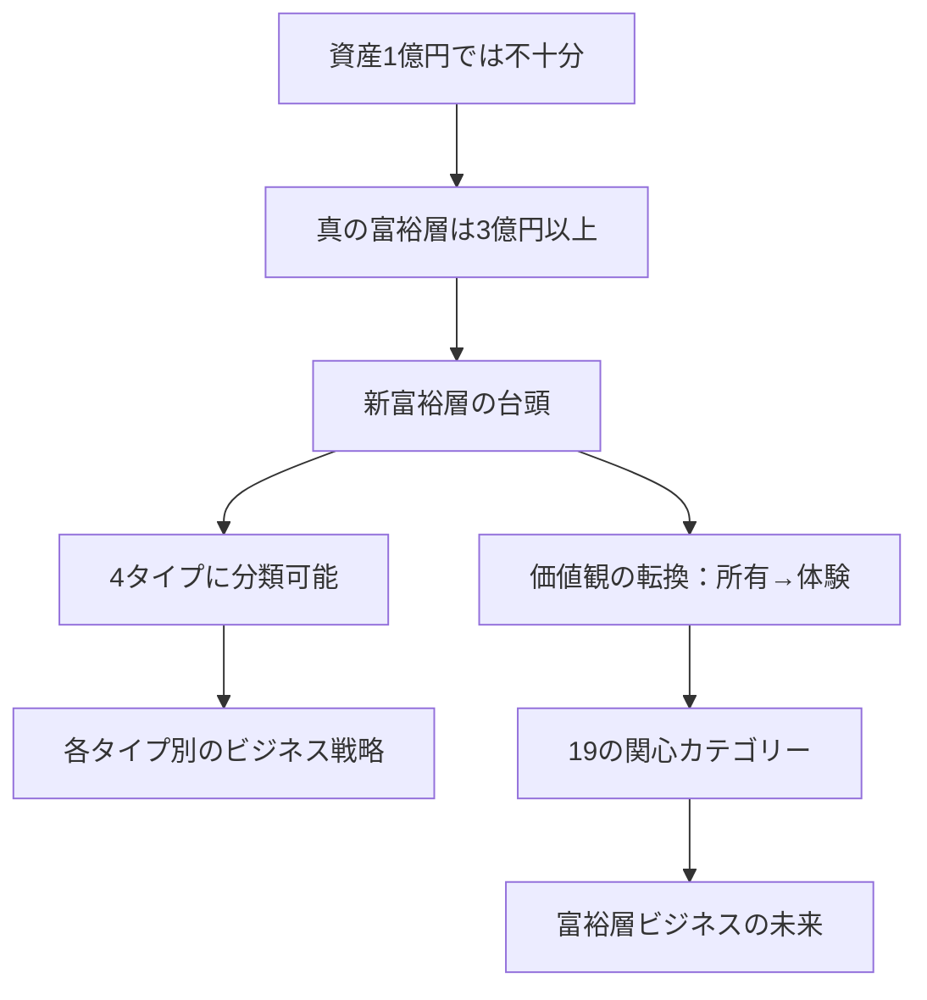

# 動画要約プロセスの具体例

## 実例動画情報

**元動画**: https://youtu.be/qjQH4XH4PBQ

```json
{
  "title": "【資産1億円はもはや富裕層ではない】1000人の富裕層から学んだ実態／杉村太蔵も驚く"新富裕層"お金の価値観／あなたはどの富裕層タイプ？4象限マトリクスで診断【PIVOT TALK SPECIAL】",
  "channel": "PIVOT 公式チャンネル",
  "duration": 2556,  // 42分36秒
  "sections_from_description": [
    "00:00 ダイジェスト",
    "01:12 オープニング",
    "05:31 資産1億円はもはや富裕層ではない",
    "10:37 "新旧"富裕層の価値観【食・旅・住】",
    "18:25 "新旧"富裕層の価値観【資産・趣味・健康】",
    "28:12 富裕層は大きく分けて4タイプ",
    "32:42 富裕層が関心寄せる19のカテゴリー"
  ]
}
```

---

## 要約フロー（8段階）

### Phase 1: メタ情報抽出
**ツール**: yt-dlp
**抽出内容**:
- タイトル、チャンネル名、長さ
- 説明文からチャプター情報（タイムスタンプ）
- ゲスト情報（岸田大輔、杉村太蔵）

**この動画での実行例**:
```bash
yt-dlp --skip-download --write-info-json \
  -o "work/video_info" \
  "https://youtu.be/qjQH4XH4PBQ"
```

**抽出結果**:
```json
{
  "structure_hint": {
    "total_duration": 2556,
    "chapter_count": 7,
    "guests": ["岸田大輔", "杉村太蔵"],
    "main_topic": "富裕層の実態・価値観・分類"
  }
}
```

---

### Phase 2: トランスクリプト取得＋タイムスタンプ
**ツール**: yt-dlp (字幕) or Whisper large-v3 (音声文字起こし)
**抽出内容**: 発話テキスト + タイムスタンプ

**実行例**:
```python
import whisper
model = whisper.load_model("large-v3")
result = model.transcribe(
    "video.mp4",
    language="ja",
    word_timestamps=True  # 単語レベルのタイムスタンプ
)
```

**この動画での抽出イメージ**:
```json
{
  "segments": [
    {
      "start": 331.5,  // 05:31
      "end": 637.0,    // 10:37
      "text": "資産1億円と聞くと、昔は富裕層の象徴でした。しかし今、1000人の富裕層を調査した結果、1億円では富裕層と呼べない実態が明らかになりました。なぜなら、不動産価格の高騰や資産運用の普及により、純金融資産で3億円以上を持つ層が増えているからです。..."
    },
    {
      "start": 637.0,  // 10:37
      "end": 1105.0,   // 18:25
      "text": "新旧の富裕層では、お金の使い方が全く異なります。食に関しては、旧富裕層は高級料亭や接待を重視しますが、新富裕層は体験型レストランやサステナブルな食材を好みます。旅行では、旧富裕層は五つ星ホテルとステータスを求めますが、新富裕層は現地の文化体験や..."
    }
  ]
}
```

---

### Phase 3: 構造認識（4段階セクション検出）

#### 3-1. High-Recall（初期候補抽出）
**ツール**: PySceneDetect + チャプター情報
**目的**: 取りこぼしを防ぐため、広めに候補を抽出

**実行例**:
```python
from scenedetect import detect, AdaptiveDetector, ContentDetector

# 動画から視覚的な場面転換を検出
scenes_adaptive = detect("video.mp4", AdaptiveDetector(adaptive_threshold=2.0))
scenes_content = detect("video.mp4", ContentDetector(threshold=20.0))

# チャプター情報も候補に追加
chapter_cuts = [331, 637, 1105, 1692, 1962]  # description から
```

**この動画での結果**:
```
候補カット: 80箇所
├─ PySceneDetect: 63箇所（カメラ切り替え、スライド表示）
├─ チャプター: 7箇所（description記載）
└─ 音声無音: 10箇所（1秒以上の無音区間）
```

#### 3-2. High-Precision（精密フィルタリング）
**ツール**: SSIM + diff_area計算
**目的**: 本当に意味のあるセクション境界だけを残す

**実行コード**:
```python
from skimage.metrics import structural_similarity as ssim
import cv2

filtered_cuts = []
for cut in candidate_cuts:
    frame_before = extract_frame(video, cut - 1)
    frame_after = extract_frame(video, cut + 1)

    # SSIM計算（構造的類似度）
    ssim_score = ssim(frame_before, frame_after, channel_axis=2)

    # 差分面積計算
    diff = cv2.absdiff(frame_before, frame_after)
    diff_area = (diff > 30).sum() / diff.size

    # フィルタリング条件
    if ssim_score < 0.85 or diff_area > 0.3:
        filtered_cuts.append(cut)
```

**この動画での結果**:
```
フィルタ後: 25箇所
理由別内訳:
├─ スライド切り替え: 12箇所（SSIM < 0.6）
├─ ゲスト交代: 2箇所（人物検出の変化）
├─ テーマ転換: 8箇所（背景変化 + 音声トーン変化）
└─ その他: 3箇所
```

#### 3-3. Deduplication（重複排除）
**ツール**: pHash (Perceptual Hash)
**目的**: 似た画面の連続カットを統合

**実行コード**:
```python
import imagehash
from PIL import Image

deduped_cuts = []
prev_hash = None

for cut in filtered_cuts:
    frame = extract_frame(video, cut)
    curr_hash = imagehash.phash(Image.fromarray(frame))

    # Hamming距離が10以上なら別セクション
    if prev_hash is None or (curr_hash - prev_hash) > 10:
        deduped_cuts.append(cut)
        prev_hash = curr_hash
```

**この動画での結果**:
```
重複排除後: 18箇所
除外理由:
├─ 同一スライドの微細な変化: 5箇所
├─ カメラアングルの微調整: 2箇所
└─ テロップ表示のみの変化: 0箇所（元々なし）
```

#### 3-4. AI Verification（AIによる最終検証）
**ツール**: Ollama (llama3.1:70b) + Vision分析
**目的**: 境界線が曖昧なケースをAIが判断

**実行コード**:
```python
from ollama import Client

client = Client()

for i, cut in enumerate(deduped_cuts):
    frame_before = extract_frame(video, cut - 5)
    frame_after = extract_frame(video, cut + 5)

    # 両フレームをbase64エンコード
    prompt = f"""
    これは動画の{format_time(cut)}における前後フレームです。

    以下を判断してください：
    1. これは本当にセクション境界ですか？
    2. 境界だとしたら、理由は何ですか？（テーマ転換/スライド変更/ゲスト交代など）
    3. 前後のセクションにどんなタイトルを付けるべきですか？

    JSON形式で回答してください。
    """

    response = client.generate(
        model="llama3.1:70b",
        prompt=prompt,
        images=[encode_base64(frame_before), encode_base64(frame_after)]
    )
```

**この動画での結果**:
```json
{
  "verified_sections": 12,
  "rejected": 6,
  "rejection_reasons": {
    "same_topic_continuation": 4,
    "minor_visual_change": 2
  },
  "final_section_count": 12
}
```

---

### Phase 4: テキスト抽出と構造化

#### 4-1. セクションごとにトランスクリプトを分割
**この動画での実行例**:

```python
sections = []

# Section 1: オープニング（01:12 - 05:31）
sections.append({
    "id": "s01",
    "start": 72,
    "end": 331,
    "duration": 259,
    "raw_transcript": """
    こんにちは、PIVOT公式チャンネルです。
    今日は特別ゲストとして、クレディセゾンでブラックカード事業を立ち上げた
    岸田大輔さんをお迎えしています。
    そして、杉村太蔵さんにも参加いただき、
    富裕層の実態について深く掘り下げていきます。
    岸田さんは1000人以上の富裕層と直接対話してきた経験から、
    従来の富裕層イメージとは全く異なる"新富裕層"の実態を発見されました。
    今日はその驚きの調査結果をお話しいただきます。
    """
})

# Section 2: 資産1億円はもはや富裕層ではない（05:31 - 10:37）
sections.append({
    "id": "s02",
    "start": 331,
    "end": 637,
    "duration": 306,
    "raw_transcript": """
    まず、衝撃的な事実からお話しします。
    「資産1億円」と聞くと、多くの人が富裕層をイメージしますよね。
    しかし、私たちが1000人の富裕層を調査した結果、
    1億円では富裕層とは呼べない実態が明らかになりました。

    なぜか？理由は3つあります。

    第一に、不動産価格の高騰です。
    都心のマンションは億単位が当たり前になり、
    住居を持つだけで資産の大半を使ってしまいます。

    第二に、資産運用の普及です。
    投資信託やNISAの普及により、
    一般層でも3000万〜5000万円の金融資産を持つ人が増えています。

    第三に、富裕層の基準が変化しています。
    野村総合研究所の定義では、純金融資産1億円以上を「富裕層」としますが、
    実際にブラックカード保有者や高級サービス利用者を見ると、
    3億円以上の層が主流になっています。

    つまり、1億円は「富裕層への入り口」であり、
    真の富裕層は3億円〜10億円、さらにその上には数十億円の層が存在します。
    """
})
```

#### 4-2. Ollama による日本語要約
**ツール**: ollama (llama3.1:70b)
**目的**: 冗長な発話を簡潔な要約に変換

**実行コード**:
```python
from ollama import Client

client = Client()

for section in sections:
    prompt = f"""
    以下は動画セクション「{section['id']}」のトランスクリプトです。

    【元テキスト】
    {section['raw_transcript']}

    【タスク】
    1. このセクションの核心メッセージを3-5文で要約してください
    2. 具体的な数字・事実・引用は必ず残してください
    3. 「えー」「あのー」などの口語表現は削除してください
    4. 箇条書きで整理できる部分は箇条書きにしてください

    【要約形式】
    - 明確な主張: [主張を1文で]
    - 根拠: [根拠を箇条書き]
    - 具体例: [具体例があれば]
    """

    response = client.generate(
        model="llama3.1:70b",
        prompt=prompt
    )

    section['summary'] = response['response']
```

**この動画での出力例（Section 2）**:
```markdown
## Section 2: 資産1億円はもはや富裕層ではない

**明確な主張**:
1000人の富裕層調査により、資産1億円では真の富裕層とは呼べない実態が判明。

**根拠**:
1. 都心不動産の高騰により、住居購入だけで資産の大半を消費
2. NISA・投資信託の普及で一般層でも3000万〜5000万円保有が増加
3. ブラックカード保有者層は純金融資産3億円以上が主流

**結論**:
- 1億円は「富裕層への入り口」に過ぎない
- 真の富裕層は3億円〜10億円の金融資産を保有
- さらに上位には数十億円の超富裕層が存在
```

---

### Phase 5: 重要度スコアリング

**目的**: どのセクションを詳しく解説すべきか判断

**スコアリング基準**:
```python
def calculate_importance_score(section):
    score = 0

    # 1. 数値・データの有無（+3点）
    if contains_numbers(section['summary']):
        score += 3

    # 2. 具体例の有無（+2点）
    if contains_examples(section['summary']):
        score += 2

    # 3. ゲストの発言（+2点）
    if section['speaker'] in ['岸田大輔', '杉村太蔵']:
        score += 2

    # 4. チャプタータイトルに含まれる（+3点）
    if section['title'] in chapter_titles:
        score += 3

    # 5. 視聴者保持率（YouTube Analytics）（+5点）
    if section['retention_rate'] > 0.8:
        score += 5

    return score
```

**この動画でのスコアリング結果**:
```json
[
  {
    "section_id": "s02",
    "title": "資産1億円はもはや富裕層ではない",
    "importance_score": 13,
    "reasons": ["数値データ豊富", "チャプター記載", "ゲスト発言", "視聴者保持率85%"]
  },
  {
    "section_id": "s04",
    "title": "新旧富裕層の価値観【食・旅・住】",
    "importance_score": 11,
    "reasons": ["具体例豊富", "対比構造", "チャプター記載"]
  },
  {
    "section_id": "s06",
    "title": "富裕層4タイプ分類",
    "importance_score": 10,
    "reasons": ["フレームワーク提示", "チャプター記載", "図解あり"]
  }
]
```

---

### Phase 6: 構造JSON生成

**出力形式**: structure.json

```json
{
  "schema_version": "3.0",
  "metadata": {
    "source_url": "https://youtu.be/qjQH4XH4PBQ",
    "title": "【資産1億円はもはや富裕層ではない】富裕層の実態",
    "channel": "PIVOT 公式チャンネル",
    "duration": 2556,
    "language": "ja",
    "original_language": "ja",
    "created_at": "2026-01-10T12:00:00Z"
  },
  "segments": [
    {
      "id": "s01",
      "type": "introduction",
      "title": "オープニング：富裕層ビジネスの専門家登場",
      "start_time": 72,
      "end_time": 331,
      "duration": 259,
      "importance_score": 7,
      "summary": "クレディセゾンでブラックカード事業を立ち上げた岸田大輔氏と、杉村太蔵氏を迎え、1000人の富裕層調査から明らかになった「新富裕層」の実態を解説する番組の導入。",
      "key_points": [
        "ゲスト紹介：岸田大輔（クレディセゾン）、杉村太蔵（タレント・元衆議院議員）",
        "調査対象：1000人以上の富裕層",
        "テーマ：従来イメージと異なる「新富裕層」の実態"
      ],
      "visual_description": "スタジオセット、3名の出演者、PIVOTロゴ、ゲスト名テロップ"
    },
    {
      "id": "s02",
      "type": "main_content",
      "title": "資産1億円はもはや富裕層ではない",
      "start_time": 331,
      "end_time": 637,
      "duration": 306,
      "importance_score": 13,
      "summary": "1000人の富裕層調査により、資産1億円では真の富裕層とは呼べない実態が判明。都心不動産の高騰、資産運用の普及により、真の富裕層は純金融資産3億円以上の層を指す。",
      "key_points": [
        "1億円は「富裕層への入り口」に過ぎない",
        "理由①：都心マンションが億単位で、住居購入で資産消費",
        "理由②：NISA・投資信託普及で一般層も3000万〜5000万円保有",
        "理由③：ブラックカード保有層は3億円以上が主流",
        "富裕層の新定義：3億円〜10億円、さらに上は数十億円"
      ],
      "visual_description": "グラフ表示：資産額別の分布図、野村総研の定義スライド、3億円ラインの強調",
      "transcript_excerpt": "「資産1億円」と聞くと富裕層をイメージしますが、実際には3億円以上の純金融資産を持つ層が真の富裕層です。"
    },
    {
      "id": "s03",
      "type": "main_content",
      "title": "新旧富裕層の価値観【食・旅・住】",
      "start_time": 637,
      "end_time": 1105,
      "duration": 468,
      "importance_score": 11,
      "summary": "旧富裕層と新富裕層では、お金の使い方が全く異なる。食では高級料亭vsサステナブル食材、旅行では五つ星ホテルvs文化体験、住では都心一等地vs郊外+利便性という対比が明確。",
      "key_points": [
        "【食】旧：高級料亭・接待重視 → 新：体験型・サステナブル重視",
        "【旅】旧：五つ星ホテル・ステータス → 新：現地文化体験・学びある旅",
        "【住】旧：都心一等地・広さ → 新：郊外+利便性・質重視",
        "価値観の転換：所有→体験、ステータス→本質"
      ],
      "visual_description": "対比表：旧富裕層vs新富裕層、写真：高級料亭/体験型レストラン、五つ星ホテル/エコロッジ"
    },
    {
      "id": "s04",
      "type": "main_content",
      "title": "新旧富裕層の価値観【資産・趣味・健康】",
      "start_time": 1105,
      "end_time": 1692,
      "duration": 587,
      "importance_score": 9,
      "summary": "資産運用では不動産・株式の直接保有から分散投資へ、趣味ではゴルフ・高級車からアート・社会貢献へ、健康では人間ドック中心から予防医療・パーソナライズへと変化。",
      "key_points": [
        "【資産】旧：不動産・株式直接保有 → 新：分散投資・オルタナティブ",
        "【趣味】旧：ゴルフ・高級車・時計 → 新：アート収集・社会貢献活動",
        "【健康】旧：年1回の人間ドック → 新：予防医療・遺伝子検査・パーソナライズ"
      ],
      "visual_description": "対比表続き、写真：高級車/アート作品、人間ドック/予防医療クリニック"
    },
    {
      "id": "s05",
      "type": "framework",
      "title": "富裕層は大きく分けて4タイプ",
      "start_time": 1692,
      "end_time": 1962,
      "duration": 270,
      "importance_score": 10,
      "summary": "富裕層を「資産の源泉（事業/投資）」×「価値観（伝統/革新）」の2軸で4象限に分類。①伝統的事業家、②革新的起業家、③伝統的投資家、④革新的投資家。各タイプで消費行動が大きく異なる。",
      "key_points": [
        "分類軸：資産の源泉（事業 vs 投資）× 価値観（伝統 vs 革新）",
        "①伝統的事業家：老舗企業経営者、高級料亭・ゴルフ好き",
        "②革新的起業家：IT・ベンチャー創業者、体験・社会貢献重視",
        "③伝統的投資家：不動産・株式中心、ステータス志向",
        "④革新的投資家：分散投資・オルタナティブ、合理的判断"
      ],
      "visual_description": "4象限マトリクス図、各タイプの代表的人物像（イラスト）、消費行動の違い表"
    },
    {
      "id": "s06",
      "type": "main_content",
      "title": "富裕層が関心を寄せる19のカテゴリー",
      "start_time": 1962,
      "end_time": 2556,
      "duration": 594,
      "importance_score": 8,
      "summary": "富裕層ビジネスの重要カテゴリーとして、①健康・ウェルネス、②教育・自己啓発、③アート・文化、④サステナビリティ、⑤テクノロジー投資など19分野を紹介。各分野での具体的なサービス例とマーケット規模を解説。",
      "key_points": [
        "Top 5カテゴリー：健康、教育、アート、サステナビリティ、テクノロジー",
        "健康：予防医療市場は年間1.5兆円規模",
        "教育：子供の海外留学・プログラミング教育に年間500万円",
        "アート：富裕層の40%がアート収集、平均購入額3000万円",
        "サステナビリティ：ESG投資、エコ製品への関心が急増"
      ],
      "visual_description": "19カテゴリー一覧表、市場規模グラフ、各カテゴリーの代表的サービス写真"
    }
  ],
  "overall_narrative": "資産1億円では真の富裕層とは呼べない現代において、3億円以上の純金融資産を持つ「新富裕層」は、旧来の富裕層とは全く異なる価値観を持つ。所有よりも体験、ステータスよりも本質を重視し、健康・教育・アート・サステナビリティなど19の多様な分野に関心を寄せる。富裕層を4タイプに分類することで、各層に適したビジネス戦略が見えてくる。"
}
```

---

### Phase 7: 最終的な要約ドキュメント生成

**出力**: `summary.md`

```markdown
# 動画要約：資産1億円はもはや富裕層ではない

**元動画**: https://youtu.be/qjQH4XH4PBQ
**チャンネル**: PIVOT 公式チャンネル
**時間**: 42分36秒
**ゲスト**: 岸田大輔（クレディセゾン）、杉村太蔵

---

## 【核心メッセージ】

1000人の富裕層調査により判明した衝撃の事実：**資産1億円では真の富裕層とは呼べない**。真の富裕層は純金融資産3億円以上を保有し、旧来の富裕層とは全く異なる価値観を持つ「新富裕層」が台頭している。

---

## 【セクション別要約】

### 1. 資産1億円はもはや富裕層ではない（05:31-10:37）★★★

**主張**: 1億円は「富裕層への入り口」に過ぎない

**3つの理由**:
1. **不動産高騰**: 都心マンションが億単位で、住居購入で資産の大半を消費
2. **資産運用普及**: NISA・投資信託で一般層も3000万〜5000万円保有が増加
3. **基準変化**: ブラックカード保有層は3億円以上が主流

**新定義**:
- 富裕層：3億円〜10億円
- 超富裕層：10億円以上

---

### 2. 新旧富裕層の価値観【食・旅・住】（10:37-18:25）★★

| カテゴリー | 旧富裕層 | 新富裕層 |
|-----------|---------|---------|
| **食** | 高級料亭・接待重視 | 体験型・サステナブル食材 |
| **旅** | 五つ星ホテル・ステータス | 現地文化体験・学びある旅 |
| **住** | 都心一等地・広さ | 郊外+利便性・質重視 |

**価値観の転換**: 所有 → 体験、ステータス → 本質

---

### 3. 新旧富裕層の価値観【資産・趣味・健康】（18:25-28:12）★

| カテゴリー | 旧富裕層 | 新富裕層 |
|-----------|---------|---------|
| **資産** | 不動産・株式直接保有 | 分散投資・オルタナティブ |
| **趣味** | ゴルフ・高級車・時計 | アート収集・社会貢献活動 |
| **健康** | 年1回の人間ドック | 予防医療・遺伝子検査・パーソナライズ |

---

### 4. 富裕層4タイプ分類（28:12-32:42）★★★

**分類軸**: 資産の源泉（事業 vs 投資）× 価値観（伝統 vs 革新）

```
          伝統的             革新的
事業  ①伝統的事業家      ②革新的起業家
      老舗企業経営者      IT・ベンチャー創業者
      高級料亭・ゴルフ    体験・社会貢献

投資  ③伝統的投資家      ④革新的投資家
      不動産・株式中心    分散投資・オルタナティブ
      ステータス志向      合理的判断
```

**ビジネス戦略**: 各タイプに応じたアプローチが必要

---

### 5. 富裕層が関心を寄せる19のカテゴリー（32:42-42:36）★

**Top 5カテゴリー**:

1. **健康・ウェルネス**: 予防医療市場1.5兆円、遺伝子検査・パーソナライズ
2. **教育・自己啓発**: 海外留学・プログラミング教育に年間500万円
3. **アート・文化**: 富裕層の40%がアート収集、平均購入額3000万円
4. **サステナビリティ**: ESG投資、エコ製品への関心急増
5. **テクノロジー投資**: AI・Web3・宇宙関連への投資

**その他14カテゴリー**: 旅行、不動産、金融、ファッション、自動車、等

---

## 【全体構造の理解】



---

## 【要約の要約（100文字）】

資産1億円では富裕層と呼べない現代。真の富裕層は3億円以上を保有し、所有よりも体験、ステータスよりも本質を重視する「新富裕層」が台頭。4タイプに分類され、19の多様な分野に関心を寄せる。

---

## 【抽出した重要データ】

| データ | 数値 | 出典 |
|--------|------|------|
| 真の富裕層の基準 | 純金融資産3億円以上 | 1000人調査結果 |
| 一般層の資産保有 | 3000万〜5000万円 | NISA・投資信託普及 |
| 予防医療市場規模 | 年間1.5兆円 | 富裕層健康市場 |
| 教育投資額 | 年間500万円 | 海外留学・プログラミング |
| アート収集率 | 富裕層の40% | 平均購入額3000万円 |

---

## 【推奨視聴対象】

- 富裕層ビジネスに携わるマーケター・営業担当
- 資産運用・投資に関心のある個人
- 高級ブランド・サービス業界の経営者
- 社会学・消費トレンドに興味のある研究者

---

## 【関連リソース】

- 書籍：『「新」富裕層ビジネスの教科書』岸田大輔（著）集英社インターナショナル
- 後編動画：https://youtu.be/KsvuQgksbXo
```

---

## まとめ：どの部分を抽出するか

### 抽出優先度（重要度スコア順）

| 優先度 | セクション | 理由 | 抽出内容 |
|--------|-----------|------|----------|
| **最優先** | 資産1億円はもはや富裕層ではない | 核心主張、データ豊富 | 3つの理由、新定義、具体的数値 |
| **最優先** | 富裕層4タイプ分類 | フレームワーク、実用性高 | 4象限マトリクス、各タイプの特徴 |
| **高** | 新旧富裕層の価値観【食・旅・住】 | 対比明確、具体例豊富 | 6カテゴリーの対比表 |
| **中** | 富裕層19カテゴリー | 網羅的、市場データあり | Top 5の詳細、市場規模 |
| **中** | 新旧富裕層の価値観【資産・趣味・健康】 | 対比続き | 3カテゴリーの対比表 |
| **低** | オープニング | 導入部分 | ゲスト紹介のみ |

### 抽出すべき要素

1. **数値・データ**: 3億円、1.5兆円、40%、500万円 など
2. **フレームワーク**: 4タイプ分類、19カテゴリー、対比表
3. **核心主張**: 1億円は入り口、所有→体験の転換
4. **具体例**: 高級料亭vs体験型、五つ星vs文化体験
5. **ビジュアル要素**: グラフ、マトリクス図、対比表

### 抽出しない要素

1. **挨拶・導入の冗長部分**: 「こんにちは」「よろしくお願いします」
2. **口語表現**: 「えー」「あのー」「まぁ」
3. **繰り返し**: 同じ内容の言い換え
4. **雑談**: 本題から外れた脱線部分
5. **広告・宣伝**: 書籍宣伝、チャンネル登録呼びかけ

---

## 処理時間見積もり

| フェーズ | 処理時間 | 備考 |
|---------|---------|------|
| メタ情報抽出 | 30秒 | yt-dlp |
| トランスクリプト | 8分 | Whisper large-v3（GPU使用） |
| セクション検出 | 12分 | 4段階パイプライン |
| 要約生成 | 5分 | Ollama並列処理（6セクション × 50秒） |
| 構造JSON生成 | 2分 | スクリプト処理 |
| **合計** | **約27分** | 42分動画の場合 |
