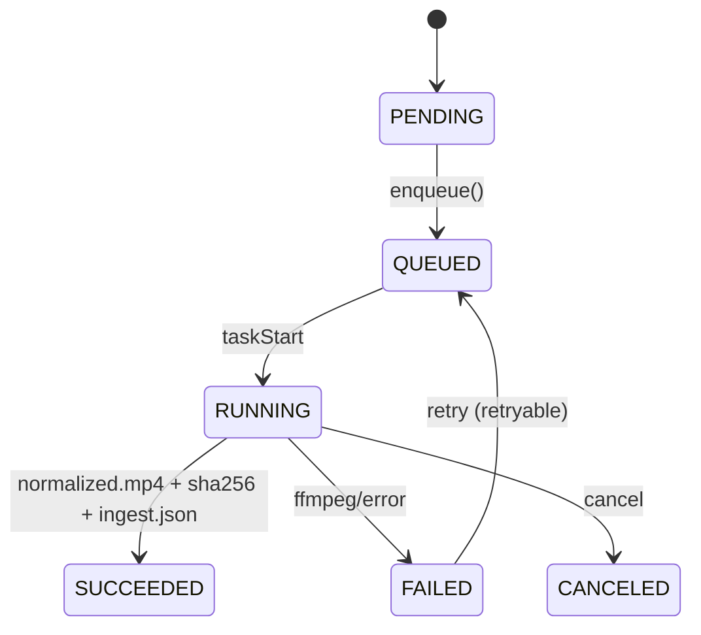
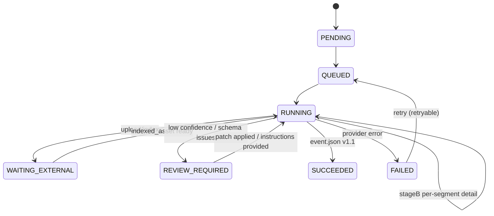
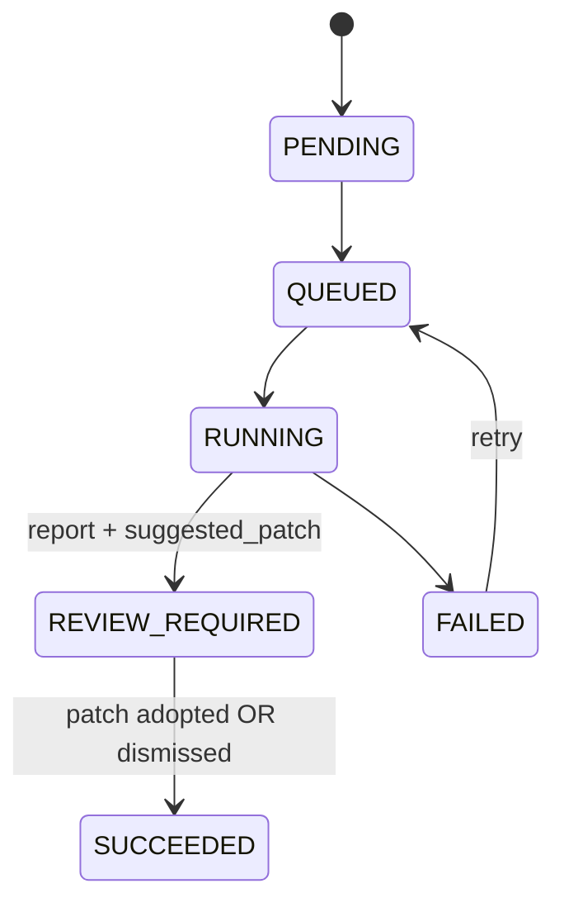
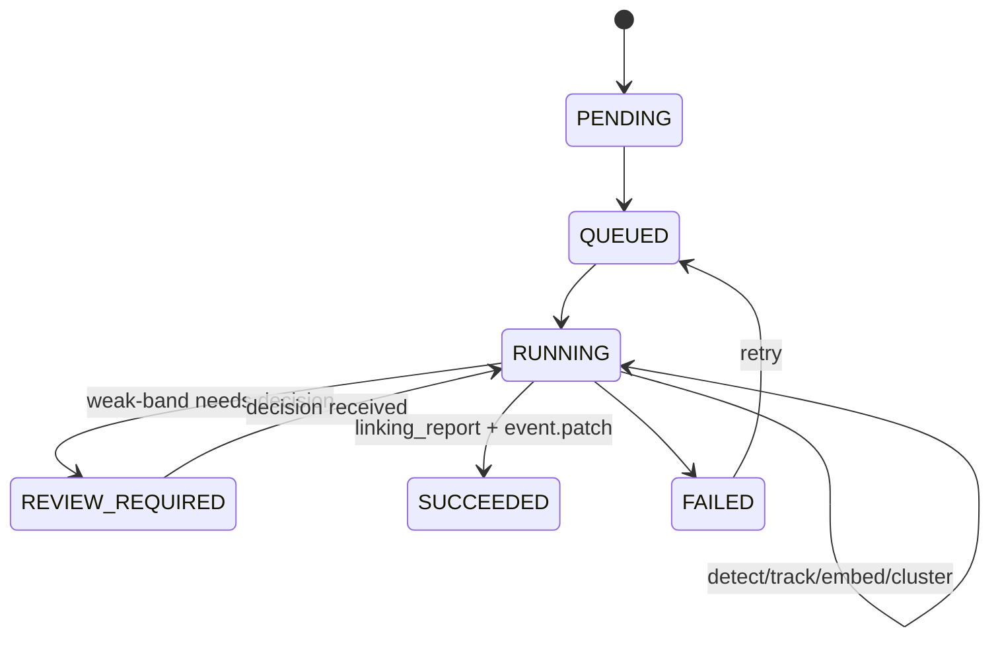
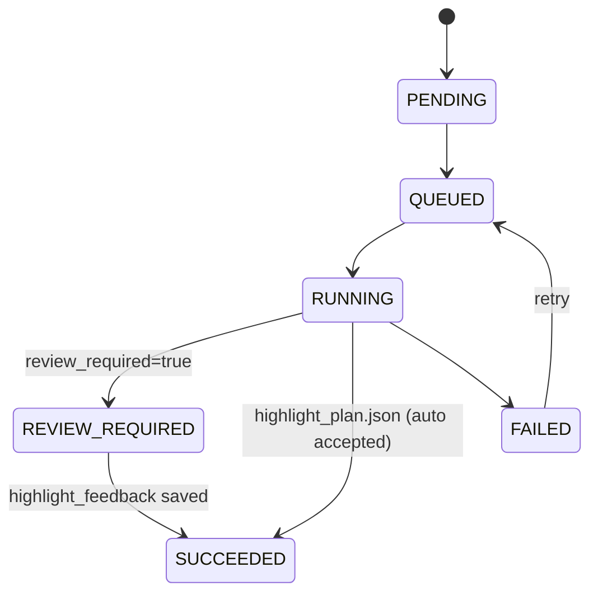
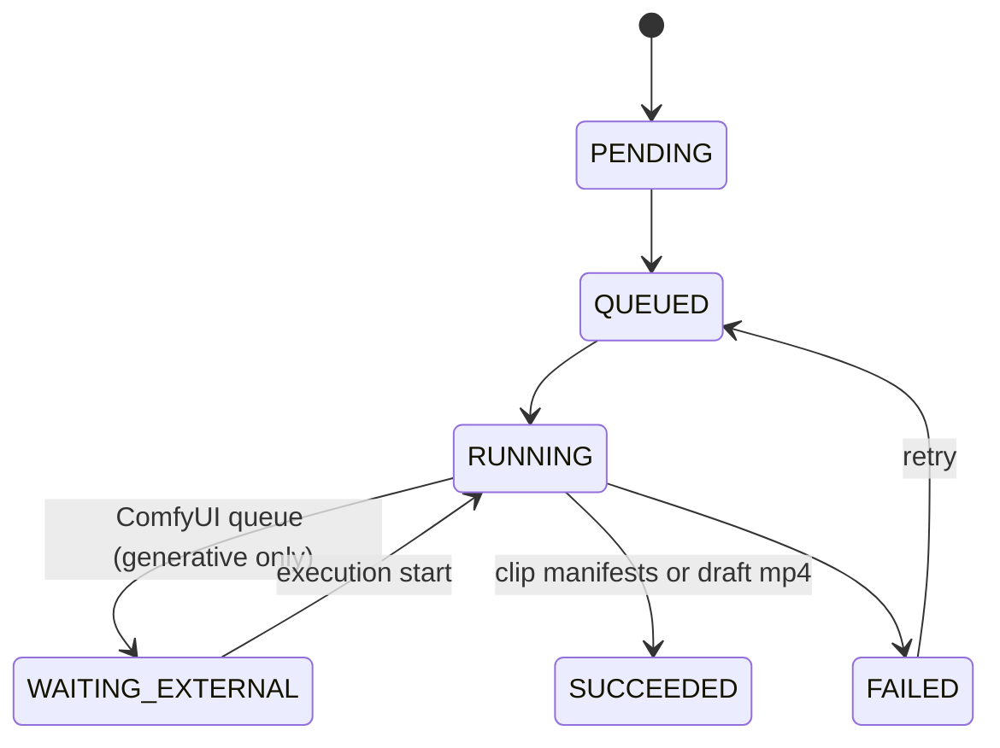
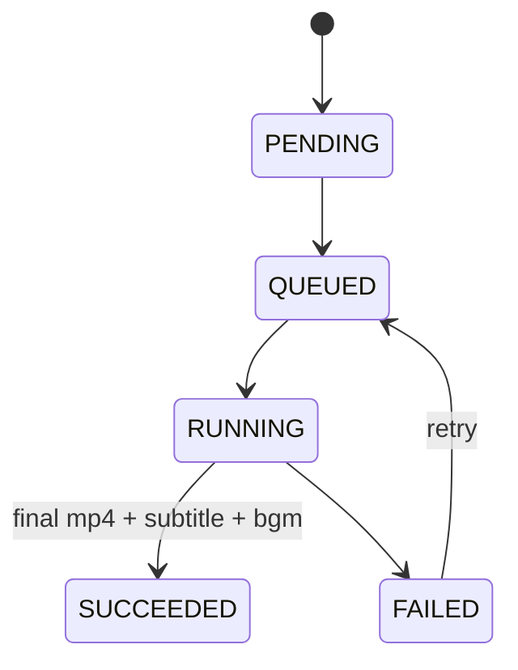
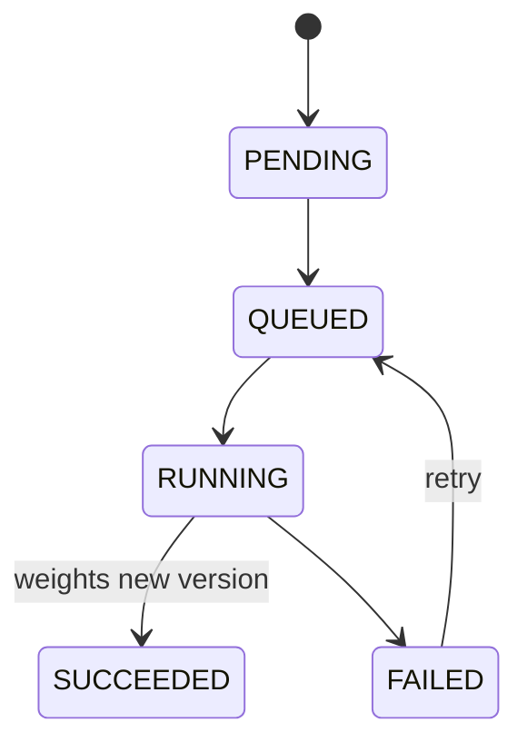

# 仕様書（UI / API / DB）

ここがあなたの要望「Next.js 15 + Prisma + Cloud Tasksでどう実装するか」の中核です。

---

## 3.1 実装アーキテクチャ（2サービス推奨）

### web（Next.js 15 / Cloud Run）
- UI
- 軽量API（DB、署名URL、Cloud Tasks enqueue）

### worker（Cloud Run / GKE / VM）
- ingest/ffmpeg、解析、OCR、embedding、render、assemble、train
- `POST /tasks/execute` を提供（Cloud Tasksから実行）

---

## 3.2 Cloud Tasks 実装の要点

| 項目 | 説明 |
|------|------|
| キュー分離 | `cpu-queue` / `gpu-queue` を分ける（詰まり防止） |
| 認証 | OIDCトークン（推奨）＋ Cloud Tasksヘッダ検証 |

### 冪等性
- **taskName** = `jobs/{jobId}` 固定（重複enqueue抑制）
- **worker側**も `Job.status=SUCCEEDED` なら即return

---

## 3.3 ジョブ種別ごとの状態遷移図

### 共通Status

```
PENDING → QUEUED → RUNNING → (WAITING_EXTERNAL / REVIEW_REQUIRED) → SUCCEEDED|FAILED|CANCELED
```

---

### INGEST



---

### ANALYZE（粗→詳細）



---

### OCR（Style抽出：提案→承認）



---

### EMBED（人物同一性）



---

### HIGHLIGHT



---

### RENDER（Remix/Generative）



---

### ASSEMBLE



---

### TRAIN



---

## 3.4 画面ごとのUIコンポーネント責務（App Router前提）

**原則**：PageはServer（認可・初期データ）／編集や監視はClient。

### /projects
| 種別 | コンポーネント |
|------|----------------|
| Server | projects取得、権限 |
| Client | ProjectList, CreateProjectButton |

### /projects/[projectId]/videos/new
| 種別 | コンポーネント |
|------|----------------|
| Client | VideoSourceTypeTabs, UrlInputForm, GcsDirectUploadWidget, UploadProgressBar |

### /projects/[projectId]/videos/[videoId]
| 種別 | コンポーネント |
|------|----------------|
| Server | video/artifacts/jobs取得 |
| Client | VideoPlayer, JobLauncherPanel, ArtifactsTimeline |

### /analysis
| 種別 | コンポーネント |
|------|----------------|
| Client | JobStatusBanner, EventTimelineView, EntityTable, OnScreenTextPanel, PatchEditor, ApproveButton |

### /highlights
| 種別 | コンポーネント |
|------|----------------|
| Client | HighlightCandidateList, SegmentPreviewPlayer, SelectionControls, FeedbackForm, SaveFeedbackButton |

### /authoring
| 種別 | コンポーネント |
|------|----------------|
| Client | AuthoringTabs, ScriptEditor, RolesEditor, AssetsManager, StyleEditor, JsonPatchDiffView, CreateOverrideRevisionButton |

### /render
| 種別 | コンポーネント |
|------|----------------|
| Client | ProfileSelector, RenderModeSelector, BgmPicker, ComfyTemplateSelector, RunRenderButton, JobStatusBanner |

### /outputs
| 種別 | コンポーネント |
|------|----------------|
| Client | OutputGallery, OutputPreviewModal, DownloadButton, DeriveNewVariantButton |

### /runs
| 種別 | コンポーネント |
|------|----------------|
| Client | RunList, RunCompare, RerunButton |

### /admin/*
| 種別 | コンポーネント |
|------|----------------|
| Client | ProviderSettings, EmbeddingThresholdSettings, TemplateManager, WeightsManager, JobMonitor |

---

## 3.5 DB（Prisma）とAPI（Route Handlers）

実装可能な Prisma schema骨格と、代表API（jobs/review/signed-url等）は別途詳細仕様を参照。
